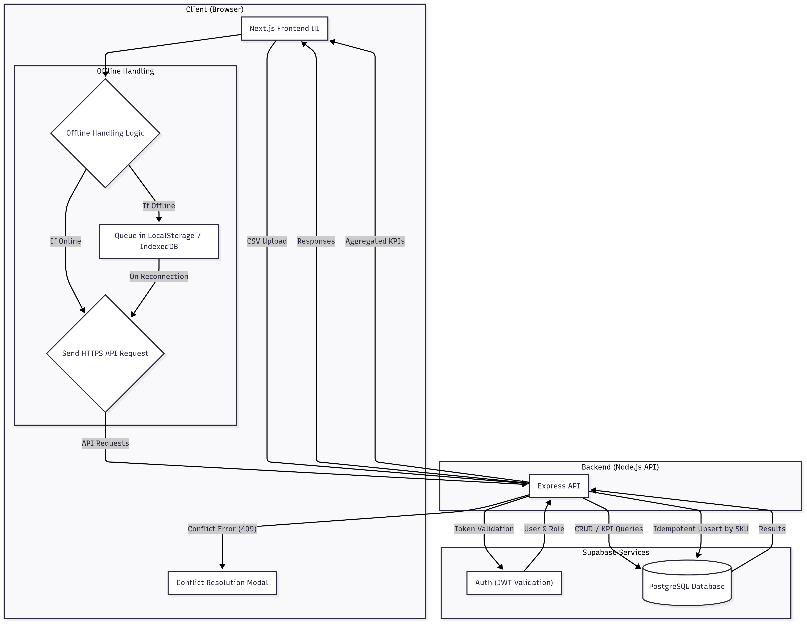

# MSME Inventory Lite

AI-Native inventory management system for corner-store chains with intermittent internet and concurrent editing capabilities.

---

## Architecture

- **Frontend**: Next.js 14 with TypeScript and Tailwind CSS  
- **Backend**: Node.js with Express  
- **Database**: Supabase (PostgreSQL + Auth)  
- **Deployment**: Vercel (Frontend + Backend)

### Architecture Diagram


Key features shown:
- Offline handling with queue and replay  
- Optimistic concurrency with conflict resolution modal  
- Role-based access control (Owner vs Staff)  
- Server-computed KPIs  
- CSV import with idempotent upsert  

---

## Data Model

### Profiles (Users)
| Column | Type | Constraints |
|--------|------|-------------|
| id | UUID (PK, references auth.users) | Required |
| email | Text | Unique |
| role | Text | Default `staff` (can be `owner` or `staff`) |

### Products
| Column     | Type          | Constraints |
|------------|--------------|-------------|
| id         | Bigserial PK | Auto-increment |
| name       | Text         | Required |
| sku        | Varchar(64)  | Unique, Required |
| category   | Text         | Optional |
| quantity   | Integer      | ≥ 0 |
| unit_price | Decimal(10,2)| ≥ 0 |
| version    | Integer      | For optimistic concurrency |
| created_at | Timestamptz  | Auto-generated |

---

## API Table

| Route                 | Method | Description | Request | Response | Errors |
|------------------------|--------|-------------|---------|----------|--------|
| `/api/auth/login`      | POST   | Authenticate user | `{email, password}` | `{token, role}` | 401 INVALID_CREDENTIALS |
| `/api/products`        | GET    | List products (search/filter) | `?q, ?category` | `[products...]` | 400 INVALID_QUERY |
| `/api/products/:id`    | GET    | Get single product | `id` | `{product}` | 404 NOT_FOUND |
| `/api/products`        | POST   | Create product | `{name, sku, category?, quantity, unit_price}` | `{product}` | 400 VALIDATION_ERROR |
| `/api/products/:id`    | PUT    | Update product | `{fields, version}` | `{updated_product}` | 403 FORBIDDEN, 409 CONFLICT |
| `/api/products/:id`    | DELETE | Delete product | `id` | `{status}` | 404 NOT_FOUND |
| `/api/import/csv`      | POST   | Upload CSV | `file` | `{row_statuses}` | 400 VALIDATION_ERROR |
| `/api/dashboard/kpis`  | GET    | Server-computed KPIs | none | `{total_items, stock_value, low_stock}` | - |
| `/api/metrics`         | GET    | Metrics/logs | none | `{counts, p95_latency}` | - |
| `/api/health`          | GET    | Health check | none | `{status: ok}` | - |

### Error Handling

All API errors follow a consistent format:

```json
{
  "error": {
    "code": "ERROR_CODE",
    "message": "Human-readable message",
    "details": { }
  }
}
```

- `403` → `PERMISSION_EDIT_PRICE`
- `409` → `CONFLICT`
- `400` → `VALIDATION_ERROR`
- `404` → `NOT_FOUND`

---

## Design Justifications

- **Optimistic Concurrency**:  
  Used a **version column**. Versions increment on each update → avoids timestamp precision issues.

- **Search Implementation**:  
  Chose **exact search + category chips** instead of fuzzy search.  
  - Lower complexity, faster for MSME scale  
  - Predictable for shopkeepers  
  - Better performance on low-end devices  

- **Offline Queue**:  
  Implemented using **LocalStorage** for simplicity (fast to build and works reliably in all browsers).  
  - Each edit is queued if offline, replayed when back online  
  - Light enough for this prototype  
  - **Limitations:** small storage (~5MB), synchronous API, may not handle very large queues  
  - In production → would switch to **IndexedDB (with Dexie.js)** for async, larger storage, and persistence across sessions 


---

## Trade-offs

- **Database**: Supabase/PostgreSQL chosen for SQL + real-time support. Firebase was an option but Postgres fits KPI aggregations better.  
- **Search**: Did not implement fuzzy search → overkill for small inventory size.  
- **Offline Sync**: Basic queue + retry with backoff → not a full production-grade sync engine.  

---

## Why Next.js (not plain React)

- **SSR/SSG out-of-the-box** → faster initial load, helps meet **<2.5s cold load requirement**  
- **Built-in routing** → less boilerplate compared to React Router  
- **App Router (Next 13/14)** → modern data fetching with server components  
- **Performance optimizations** (code-splitting, image optimization) baked in  
- **API routes (optional)** for quick prototyping  

👉 Plain React would require manual setup for SSR, routing, and optimizations. Next.js gives these for free, accelerating delivery.

---

## Why Node.js (not Python)

- **Single language stack (JS/TS full-stack)** → frontend + backend in same language  
- **Express** → minimal, fast, and well-supported  
- **Easier deployment** on Vercel compared to Python (no WSGI/ASGI)  
- **Supabase SDKs** integrate seamlessly in Node.js ecosystem  
- Great for **I/O heavy** inventory CRUD operations  

👉 Python (FastAPI) is solid, but for a 48–72h build Node.js reduces context switching and speeds up iteration.

---

## Project Structure

- `frontend-nextjs/` → Next.js frontend application  
- `backend-node/` → Express API server  
- `prompts/` → AI prompt receipts and documentation  
- `docs/` → Diagrams and additional documentation  

---

## Testing

- **API Test**: Jest + Supertest → verifies stale update returns `409 CONFLICT`.
- **UI Test**: Playwright → verifies the conflict resolution modal appears when server returns conflict/permission error.


---

## Getting Started

1. Install dependencies for both frontend and backend  
2. Set up Supabase database (schema migrations included)  
3. Configure environment variables  
4. Run development servers  

**Access the applications:**  
- Frontend → http://localhost:3000  
- Backend API → http://localhost:4000  
- Health Check → http://localhost:4000/api/health  